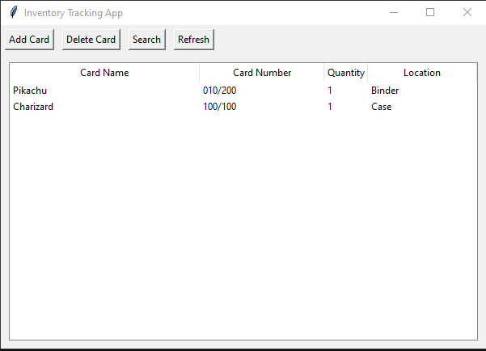
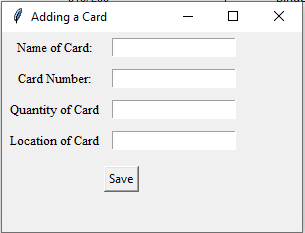
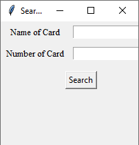

# Inventory-Tracking-App

A desktop inventory tracking application for Pokémon TCG cards. This app allows users to add, delete, search, and view cards stored in a local SQLite datbase.

## Features
- Add cards with a name, card number, quantity, and location
- Delete cards by card name and card number
- Search for cards by name and card number
- Store inventory data locally using SQLite
- Display card inventory in a Tkinter table view

## Tools Used
- Python
- Tkinter
- SQLite

## Screenshots

## Main Inventory View

## Adding a Card

## Searching for a Card

## Future Improvements
- Improve GUI design
- Add features for clicking in the main window (edit/delete)
- Add sorting/filtering functions
